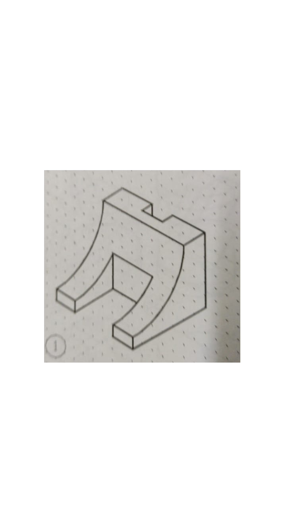
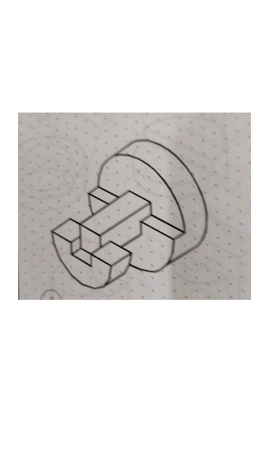

# CAD Modelling Task

## Installation
Your task will be done using the Fusion 360 software, which can be downloaded using your BITs Email ID. Click on the link below and complete the installation of the software before proceeding. -
[Fusion360 Download link](https://www.autodesk.com/education/edu-software/overview?sorting=featured&page=1)

 - Create an autodesk account with your bits email address.
 - Look for the option to download fusion 360. Make sure you are downloading the education version of the application. (The link above should guide you to the education page.)

## Reference courses
Before proceeding with the actual task, it’s better to understand the software and get some hands on experience with Fusion 360. Follow these youtube tutorials to get the feel of fusion 360 -

1. [https://www.youtube.com/watch?v=A5bc9c3S12g&list=PL40d7srwyc_Ow4aaOGXlP2idPGwD7ruKg](https://www.youtube.com/watch?v=A5bc9c3S12g&list=PL40d7srwyc_Ow4aaOGXlP2idPGwD7ruKg)
	 - This playlist gives you a thorough understanding of the different tools in fusion and gives you a good hands on experience of how to work with the application

2. [https://youtu.be/lyTULzvHhXw](https://youtu.be/lyTULzvHhXw)
 [https://youtu.be/hAGFkWkqocI](https://youtu.be/hAGFkWkqocI)
	- These tutorials will give you a good understanding about the optimizing the material used and ensuring maximum efficiency while working with different elements.

3. [https://youtu.be/DoC8GQmAyYM](https://youtu.be/DoC8GQmAyYM)
    - This tutorial will give you an in depth idea of designing your own drone from scratch. A lot of the techniques used in this tutorial will be beneficial for the task.

4. [https://youtu.be/IE2aQiEbwjQ](https://youtu.be/IE2aQiEbwjQ)
	- This tutorial will help you analyze the impact of forces and tensions in your model. It is important to understand how well your design will hold on to real life stresses and forces.

For practice, try making these shapes on fusion -

## Task
Finally after completing all the tutorials and getting used to the software, let's move on to the task -
So far you have learnt multiple techniques to make your own models and are ready to create your very own model from scratch.
For the task you will be needed to make a simple land rover.
All the skills required for this are provided in the above mentioned tutorials.  
You have learnt how to make cavities in the chassis(or the main body) of elements and how to add other components such as lids, holes and various other techniques to make various models.

Here are some design specifications which will help as a guide to make your rover. They can be used as landmarks while completing your design.

#### Sensors
 - Velodyne Lidar sensor (model - alpha prime)
 - Intel Realsense Depth Camera (model - d435i)
 - HydraProbe (Temp, moisture, salinity, EC)(HydraProbe Pro with SDI-12 interface)

#### Robotic arm
 - Needed 6 DOF, with gripper arm mechanism. (Dimensions are up to you)
#### Wheels
 - 6 wheeled rover, wheel type of your choice.  (should support off terrain mobility)
#### Motors
 - For wheels - 24DC geared motors (Planetary DC Geared Motor 350 RPM 78N-CM     24V IG45-14K)
Servo motors(TowerPro MG995)

If you have any query about the dimensions of the parts, you are allowed to use the internet. Reference of rovers can be taken from the internet, but make sure your model for the rover is not plagiarized from anywhere.
You can add a few extra elements to your rover if you find it necessary.
