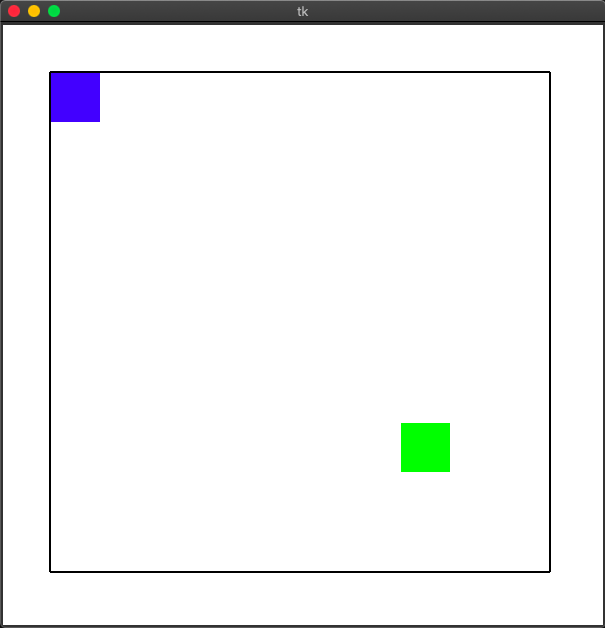

# Building a Maze solving system on ROS

This task involves making a path planning algorithm as a part of a ROS Node. You will be need to learn the basics of ROS, and some basic path planning algorithms to do this task.

## Install and Learn basics of ROS

You can install ROS using the following ways:-

- Setup ROS melodic on Ubuntu 18.04 OS
- Setup on a VM on windows
- Setup ros using a docker image

### 1) Setup ROS Melodic on Ubuntu 18.04 OS

#### Install ROS
```bash
$ sudo sh -c 'echo "deb http://packages.ros.org/ros/ubuntu $(lsb_release -sc) main" > /etc/apt/sources.list.d/ros-latest.list'
$ sudo apt-key adv --keyserver 'hkp://keyserver.ubuntu.com:80' --recv-key C1CF6E31E6BADE8868B172B4F42ED6FBAB17C654
$ sudo apt update
$ sudo apt install ros-melodic-desktop-full
$ echo "source /opt/ros/melodic/setup.bash" >> ~/.bashrc
$ source ~/.bashrc
```

#### Setup the workspace
```bash
$ mkdir -p ~/robocon/catkin_ws/src
$ cd ~/robocon/catkin_ws
$ catkin_make
$ source devel/setup.bash
## Note you will have to source the workspace everytime before using it
```
Install other necessary packages
```bash
$ sudo apt install python3-catkin-tools python3-osrf-pycommon
```

### 2) Setup on a VM (Skip if already done step 1)

Use Ubuntu 18.04 on VM and same steps as given in Step 1.

### 3) Setup ros using a docker image

To setup ros on using a docker image, you need to follow the instructions [here](http://wiki.ros.org/docker/Tutorials/Docker). Note that the image you need to install is ros:melodic-ros-base

## Get Started with basic of ROS

Follow the tutorials given [here](http://wiki.ros.org/ROS/Tutorials)

You should complete the beginner level tutorials, and develop a good understanding of what nodes, topics are and how they communicate.

Don't get overwhelmed by the number of tutorials, they are simple tutorials only and won't take long to finish.

## Install tkinter

Follow this tutorial and you should be set - https://riptutorial.com/tkinter/example/3206/installation-or-setup

## Setup the provided package

Assuming you have a terminal window running with roscore command. To do this source your ros installation and run roscore.

Continue in a new terminal window with the ros installation sourced -

The task is going to be performed on the path_planning package given in this repository. You need to move it into your catkin workspace and build it with python3
```bash
catkin_make -DPYTHON_EXECUTABLE=/usr/bin/python3
```

After having done that, source the workspace

```bash
source devel/setup.bash
```

Then, run the following command to make sure everything is working fine

```bash
rosrun path_planning MapNode.py
```

If everything has been installed properly, you'll see the following tkinter window pop up -



Here, the blue box represents the cell currently occupied by the bot and the green box represents the final position. The walls in the map are not shown yet, since the robot hasn't been to those cells and hence doesn't know about them.

## Your Evaluative Task

So the package provided has the following folders -

### maps

This folder contains the maps you can work on. Currently one map (map1.txt) is provided for you to test your algorithm on, but you are free to make more.

Each map file has the following format -
```bash
map_width map_height
start_coord_x start_coord_y end_coord_x end_coord_y
< array representing map walls >
```

### msg

This folder contains the custom msgs which are to be used for communication among the ROS nodes provided. You don't have to edit/modify this folder's contents

### scripts

This folder contains the various scripts in which the ROS nodes are running.

 - ##### MapClass.py

    This file contains the data structure used for the map of the maze.

    The map is represented as an array of integers. Each integer is a number from 0-15 and represents the walls adjacent to that cell in Top-Left-Right-Bottom convention with values as 8-4-2-1

    Basically a square with say top and bottom walls only will have value = 8(top) + 1(bottom) = 9

- ##### MapNode.py

   This file initializes the ROS node and provides a graphic interface using the map.

   The script starts a ROS Node named map-node which has one publisher and one subscriber.

   The subscriber subscribes to the /direction topic and on receiving the direction of movement, it moves the robot in that direction. Right after the movement is done, the publisher is called to inform the bot of the walls of the new cell.

   The publisher publishes to the /walls topic and publishes data about the walls on the current position of the robot. This is done to emulate the real world maze, where the robot can only see the walls of the position it is on currently.

- ##### PlannerNode.py

  This file is where you'll be doing all of your work. You have been provided with template code. You need to make and implement an algorithm, which will decide the direction of movement of the robot and publish it to the /direction topic, whenever it receives information about the walls of the current cell from the /walls topic.

  Some things to keep in mind -

  - It is guaranteed that the bottom direction will be the first step the robot has to take and this is already implemented in the script as an example.
  - You cannot access the map directly. Only the data from the /walls topic is accessible to you and your algorithm needs to be based on that. You are free to store this data, if you so require (Wink)
  - You will be judged on efficiency of your algorithm, so make sure to think the problem through well.


`Since this task requires a lot of understanding of the workings, we really recommend you contact us in case you don't understand anything. Also you are expected to attend the briefing session for this task.`
