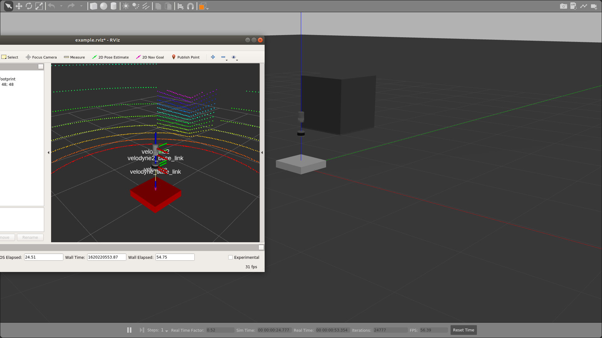
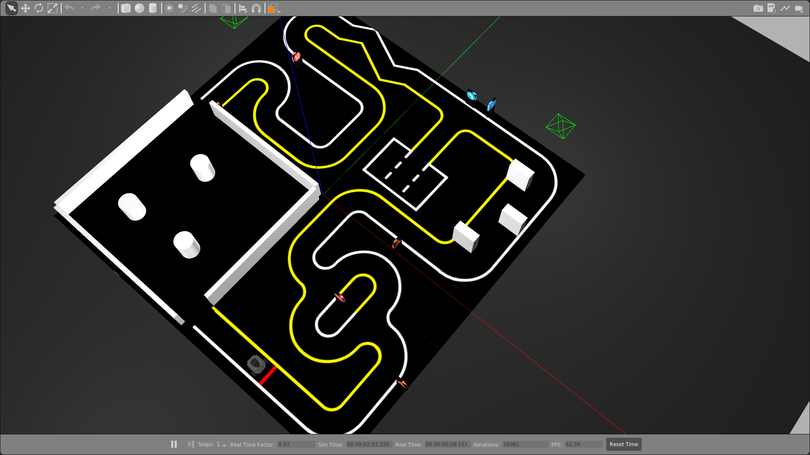

# `TASK: Hands on with Gazebo and semantic segmentation`

You can achieve the required setup for this tutorial cum recruitment task in 4 ways:-
1. [Use the docker image that we have provided at docker hub](#1-setting-up-the-workspace-on-a-docker-container) - *ideal if no dedicated graphic driver*.
2. [Use Ubuntu 18.04 operating system](#2-setup-on-ubuntu-1804-os) - *ideal to obtain best performance*.
4. Use [TheConstructSim](https://www.theconstructsim.com/) (an online service which provides full support to ROS, Gazebo and other required tools) - *ideal if you have fast internet*.
5. [Use a Virtual machine](#4-setup-on-vm).
6. [Use a Virtual machine for 22.04 (Updated for ROS2)](#4-setup-on-vm).


## 1. Setting up the workspace on a Docker Container:
#### Install docker for your operating system:
* `Ubuntu 18.04`
```bash
$ sudo apt-get update -y
$ sudo apt install docker.io
$ sudo systemctl start docker
$ sudo systemctl enable docker
# To verify if docker is active (running), type below command
$ sudo systemctl status docker  # To exit press `q`
```
* For other operating systems like `Mac OS`, `Windows 10` or older, other `Linux` distros, please follow [docker official docs](https://docs.docker.com/get-docker/).

#### Setup the container using robocon image
* `Ubuntu 18.04`
```bash
# Open your terminal
$ sudo groupadd docker
$ sudo usermod -aG docker $USER
$ newgrp docker
# Pull the robocon image by using below command
$ docker pull twinkletwinkle/robocon
# Grant permission for GUI apps to access monitor from docker container.
$ xhost local:root
# Create the container
$ docker run -it -e DISPLAY=$DISPLAY \
      --net=host --privileged \
      -v /tmp/.X11-unix:/tmp/.X11-unix \
      -v /home/robocon:/home/robocon \
      twinkletwinkle/robocon bash
```
**NOTE**: The command `xhost local:root` is overwritten upon OS reboot, so needs to be run again post reboot.


* `Docker on Windows`
```bash
# Open Powershell with Administrator privilege (because we need Admin privileges to install the new softwares)
install chocolatey from https://chocolatey.org/install

# install vcxsrv
> choco install vcxsrv

# Once vcxsrv is installed, you will see "XLaunch" application in start menu
# Download config1.xlaunch from the repo and run it. This will start the display server on your machine with desired settings.

## The next commands don't require Powershell with admin privileges. So you can now open Powershell normally.

# Copy your *IPv4 Address* of the format 192.168.xxx.xxx
> ipconfig

# Set DISPLAY variable to the obtained IPv4 Address (Replace xxx.xxx by your address)
> set-variable -name DISPLAY -value 192.168.xxx.xxx:0.0 

# Pull the robocon image by using below command
> docker pull twinkletwinkle/robocon

# Make and run container from the pulled image
>  docker run -it -e DISPLAY=$DISPLAY --net=host --privileged -v /tmp/.X11-unix:/tmp/.X11-unix -v /home/robocon:/home/robocon twinkletwinkle/robocon bash
```
**NOTE**: 
1. The command `set-variable -name DISPLAY -value 192.168.xxx.xxx:0.0 ` should be run in every new window of Powershell that you open.
2. The IPv4 address changes upon reboot. So be sure to get the new ip every time you reboot. 


### To open same container the next time you start working on tasks
* `Docker on Ubuntu (VM or Installed directly on Machine)`
```bash
# Grant permission for GUI apps to access monitor from docker container.
$ xhost local:root

# Get container name (It was already made from image the first time you ran it)
> docker ps -a

# Start the same container (if not already running)
> docker start <name-of-container>
> docker exec -it -e DISPLAY=$DISPLAY  <name of container> bash
```

* `Docker on Windows`
```bash
# Copy your *IPv4 Address* of the format 192.168.xxx.xxx
> ipconfig

# Set display variable
> set-variable -name DISPLAY -value 192.168.xxx.xxx:0.0

# Get container name (It was already made from image the first time you ran it)
> docker ps -a

# Start the same container (if not already running)
> docker start <name-of-container>
> docker exec -it -e DISPLAY=$DISPLAY  <name of container> bash
```

#### Change directory to workspace
**Note that `$` is indicating your normal terminal, whereas `#` is being used when commands are run on a docker container.**
```
# echo "export SVGA_VGPU10=0" >> ~/.profile
# export SVGA_VGPU10=0
# mv /home/catkin_ws /home/robocon/
# cd /home/robocon/catkin_ws
# echo "source /opt/ros/melodic/setup.bash" >> ~/.bashrc
# echo "cd /home/robocon/catkin_ws" >> ~/.bashrc
# echo "export TURTLEBOT3_MODEL=burger" >> ~/.bashrc
# echo "source devel/setup.bash" >> ~/.bashrc
# source ~/.bashrc
# ls
```
**Output**: `build  devel  logs  src`

**Note**: For every new bash, it automatically sources setup.bash, but just to be double sure you can source setup.bash manually (`source devel/setup.bash`)

#### Verify that GUI apps are running correctly in the container
```
# glxgears
```
The output should be exactly as below:


If you are able to get the above output, awesome :sunglasses:.
Your setup is done, so jump to [trying out turtlebot 3](#playing-with-turtlebot3).

## 2. Setup on Ubuntu 18.04 OS
#### Install ROS
```bash
$ sudo sh -c 'echo "deb http://packages.ros.org/ros/ubuntu $(lsb_release -sc) main" > /etc/apt/sources.list.d/ros-latest.list'
$ sudo apt-key adv --keyserver 'hkp://keyserver.ubuntu.com:80' --recv-key C1CF6E31E6BADE8868B172B4F42ED6FBAB17C654
$ sudo apt update
$ sudo apt install ros-melodic-desktop-full
$ echo "source /opt/ros/melodic/setup.bash" >> ~/.bashrc
$ source ~/.bashrc
```
#### Install Gazebo
```bash
$ sudo apt-get install curl
$ curl -sSL http://get.gazebosim.org | sh
$ sudo apt install ros-melodic-gazebo*
$ export GAZEBO_MASTER_URI=http://localhost:11348
```
#### Setup the workspace
```bash
$ mkdir -p ~/robocon/catkin_ws/src
$ cd ~/robocon/catkin_ws
$ cd src
# semantic segmentation main package
$ git clone https://github.com/lorenwel/linefit_ground_segmentation.git
# its dependencies
$ git clone https://github.com/catkin/catkin_simple.git
$ git clone https://github.com/ethz-asl/glog_catkin.git
cd ..
```
Install other necessary packages
```bash
$ sudo apt install python3-catkin-tools python3-osrf-pycommon ros-melodic-tf ros-melodic-gazebo-ros ros-melodic-pcl-ros ros-melodic-urdf libtool ros-melodic-xacro ros-melodic-turtlebot3-msgs ros-melodic-rviz libgoogle-glog-dev ros-melodic-robot-state-publisher
$ sudo ln -s /usr/include/eigen3/Eigen /usr/local/include/Eigen
```
This will take some time, so grab some snacks and relax :coffee:
```bash
# Ignore the warnings if all packages get built successfully.
$ catkin build --workspace .

# Build the turtlebot3 package
$ cd src
$ git clone https://github.com/ROBOTIS-GIT/turtlebot3.git
$ git clone https://github.com/ROBOTIS-GIT/turtlebot3_simulations.git
$ cd ..
# This should be quicker than previous time
# Ignore the warnings if all packages get built successfully.
$ catkin build --workspace .
```
Your setup is done, so jump to [trying out turtlebot 3](#playing-with-turtlebot3).

## 3. Setup on TheConstructSim
You can setup as in [step 2](#2-setup-on-ubuntu-1804-os), ros and gazebo are pre-installed.

## 4. Setup on VM
Use Ubuntu 18.04 on VM and and then follow same steps as in [Step 1](#1-setting-up-the-workspace-on-a-docker-container).

## Getting Started with ROS
For this task, we do not need to go deep into ROS, and a basic understanding is sufficient. You can get started by reading [this](https://bitsrobocon.github.io/BlogArticles/IntroducingROS-LinuxofRobotics) blog.

## Playing with TurtleBot3
You can choose any model of TurtleBot3 from `burger`, `waffle`, `waffle_pi`. Here we are using burger.

For this tutorial, three separate docker bash would be required.

**To open a docker bash, open a new terminal and enter below commands**

The below 3 lines are repetitive in nature whenever a new docker bash needs to be opened.
```
$ docker exec -it <name-of-your-container> bash
# cd /home/robocon/catkin_ws
# source devel/setup.bash
```
In docker bash 1,
```
# export TURTLEBOT3_MODEL=burger
# roslaunch turtlebot3_gazebo turtlebot3_world.launch
```
The above command would launch a Gazebo world


`EVAL 1`: Record a short screen video of the gazebo world you have just opened.

Now in a separate docker bash 2
```
# apt-get update && apt-get install ros-melodic-gmapping
# roslaunch turtlebot3_slam turtlebot3_slam.launch slam_methods:=gmapping
```
And finally in the docker bash 3
```
roslaunch turtlebot3_teleop turtlebot3_teleop_key.launch
```

Remember the controls:
```bash
                          w (forward)
  (rotate clockwise) a    s    d (rotate anticlockwise)
                          x (backward)
```

**What are we doing again?**
* **Bash 1**: Open the gazebo simulation which contains the turtlebot3 and the world it is in. It mimicks a real environment.
* **Bash 2**: Open RViz which is used to visualize the 2D map generated, it can also be used to visualize many other sensor outputs.
* **Bash 3**: It's openining Teleop, which we shall use to control the navigation of the turtlebot3.

The below GIF summarizes this tutorial:


`EVAL 2`: You need to save the map that has been generated in rviz, by opening a docker bash 4 and using below command.
```
# apt-get install ros-melodic-map-server
# rosrun map_server map_saver -f ~/map
```


**The saved map.pgm file needs to be submitted.**

## Playing with Semantic Segmentation
### Brief info:
* We will be using a package based upon "Himmelsbach et al. Fast segmentation of 3d point clouds for ground vehicles, Intelligent Vehicles Symposium (IV), 2010 IEEE"
* It classifies input point cloud data into obstacle and ground point cloud. There are multiple advantages of this segmentation in mapping and autonomous navigation.

We will be making use of a pcd file to generate a fake poincloud feed from a lidar.
In a docker bash, in directory catkin_ws enter below command
```
# apt-get install nano
# nano src/linefit_ground_segmentation/linefit_ground_segmentation_ros/launch/segmentation.launch
```
Replace Line 8 with this: `<param name="input_topic" value="/cloud_pcd" />`

What we are doing above is telling the ros node to subscribe to `/cloud_pcd` topic for point cloud input. Close the editor and in the same bash continue as below
```
# roslaunch linefit_ground_segmentation_ros segmentation.launch
```
In another docker bash,
```
rosrun pcl_ros pcd_to_pointcloud src/linefit_ground_segmentation/doc/kitti.pcd 0.1
```
Finally in a third docker bash, open RViz and visualize the original point cloud, the ground point cloud and the obstacle point cloud
```
# rosrun rviz rviz
```
Follow below GIF, to understand how to visualize in RViz


`EVAL 3`: Submit screenshots for all the 3 visualizations you do.

#### Check if the sensor is working properly by entering below command
```
# roslaunch velodyne_description example.launch
```
A **gazebo sim** and **RViz** should open up displaying the model and the point cloud as below respectively.


`EVAL (Final)`:
1) Your final task is to add one of the velodyne lidar model (from the package velodyne_simulator) to the turtlebot3 model. You can learn how to do so from [Gazebo official docs](http://www.gazebosim.org/tutorials?tut=add_laser). You might also need to transform the point cloud from `velodyne` frame to `base_link` frame. For more details you can refer the ros package and its tutorials [tf2](http://wiki.ros.org/tf2).
2) Change the input topic name in the package linefit_ground_segmentation to get `/velodyne_points` as we did it [above](#).
3) Navigate the turtlebot3 (using teleop as done above) around one of the worlds below:-
* **World 1: Autorace world**
```
roslaunch turtlebot3_gazebo turtlebot3_autorace.launch
```

* **World 2: Autorace 2020  world**
```
roslaunch turtlebot3_gazebo turtlebot3_autorace_2020.launch
```

* **World 3: House world**
```
roslaunch turtlebot3_gazebo turtlebot3_house.launch
```


**So which world to use finally?** :thinking:
The world you will be using would depend on your BITS ID.

**Last numeric digit % 3**
* 0 => World 1
* 1 => World 2
* 2 => World 3
(eg. 8 % 3 = 2, therefore use world 2)
4) Visualize the ground and obstacle pointlcloud in Rviz as done above.
5) Record your visualization and submit it.

**NOTE**: You need to submit the outputs for all `EVAL` (or whichever you were able to finish) as has been mentioned.
