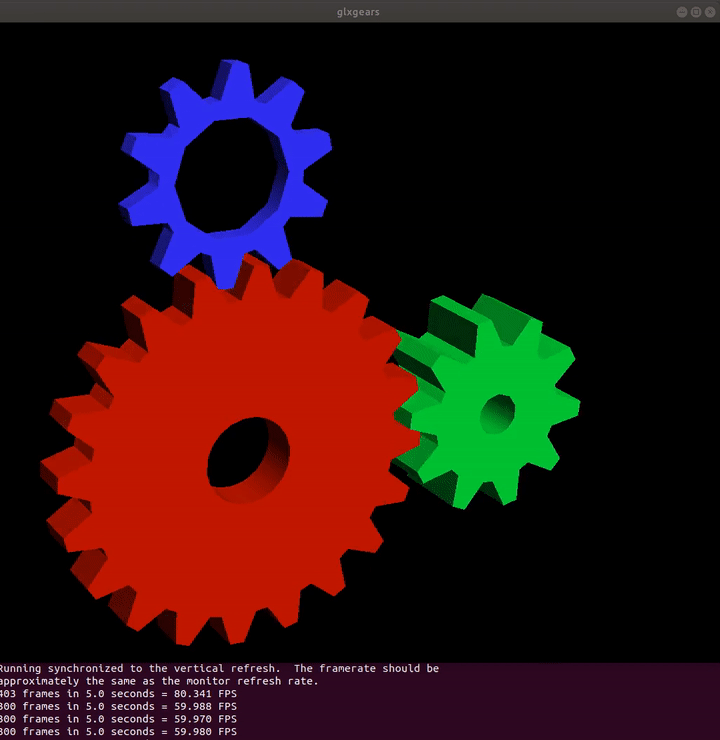
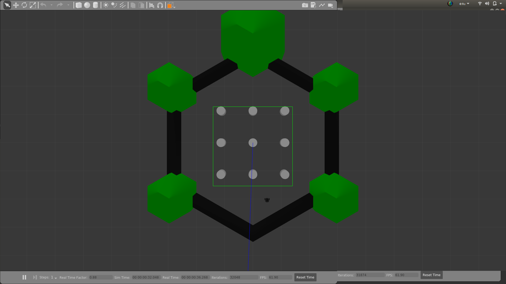
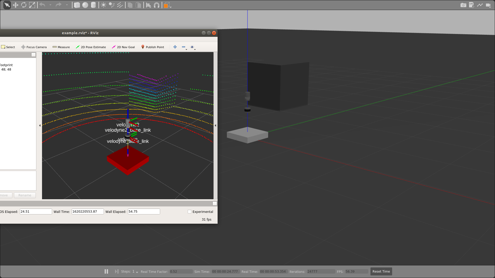
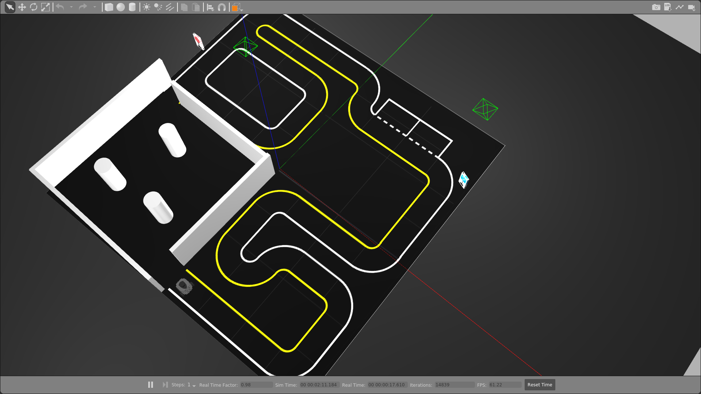
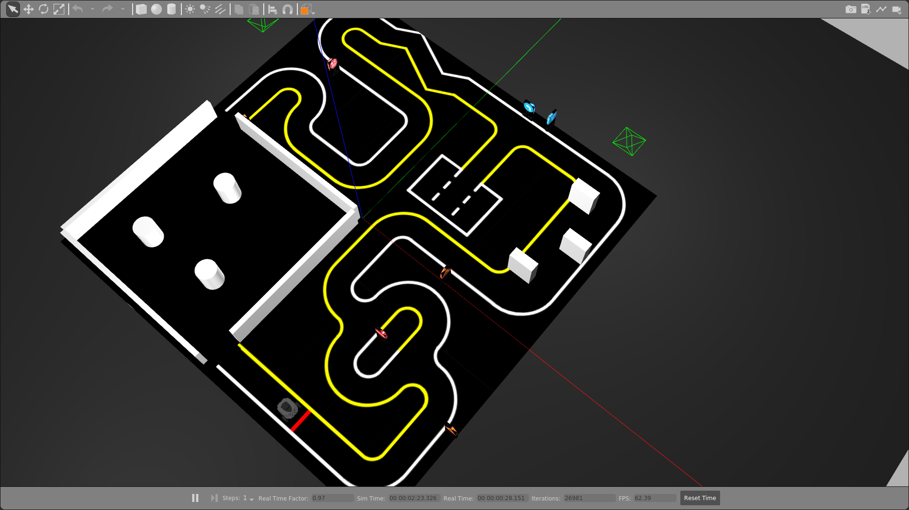

# `TASK: Hands on with Gazebo and semantic segmentation`

You can achieve the required setup for this tutorial cum recruitment task in 4 ways:-
1. Use the **docker** image that we have provided at [docker hub](https://hub.docker.com/r/twinkletwinkle/robocon) - *ideal if no dedicated graphic driver*.
2. Use Ubuntu 18.04 operating system - *ideal to obtain best performance*.
3. Use [TheConstructSim](https://www.theconstructsim.com/) (an online service which provides full support to ROS, Gazebo and other required tools) - *ideal if you have fast internet*.
4. Use a Virtual machine.

## 1. Setting up the workspace on a Docker Container:
#### Install docker for your operating system:
* `Ubuntu 18.04`
```bash
$ sudo apt-get update -y
$ sudo apt install docker.io
$ sudo systemctl start docker
$ sudo systemctl enable docker
# To verify if docker is active (running), type below command
sudo systemctl status docker
```
* For other operating systems like `Mac OS`, `Windows 10` or older, other `Linux` distros, please follow [docker official docs](https://docs.docker.com/get-docker/).

#### Setup the container using robocon image
```bash
# Open your terminal
# Pull the robocon image by using below command
$ docker pull twinkletwinkle/robocon
# Grant permission for GUI apps to access monitor from docker container.
$ xhost local:root # This command is overwritten upon OS reboot, so needs to be run again post reboot
# Create the container
$ docker run -it -e DISPLAY=$DISPLAY \
      --net=host --privileged \
      -v /tmp/.X11-unix:/tmp/.X11-unix \
      -v /home/robocon:/home/robocon \
      robocon bash
```

#### Change directory to workspace
**Note that `$` is indicating your normal terminal, whereas `#` is being used when commands are run on a docker container.**
```
# cd /home/robocon/catkin_ws
# echo "source /opt/ros/melodic/setup.bash" >> ~/.bashrc
# source ~/.bashrc
# ls
```
**Output**: `build  devel  logs  src`

**Note**: For every new bash, source setup.bash (`source devel/setup.bash`)

#### Verify that GUI apps are running correctly in the container
```
# glxgears
```
The output should be exactly as below:



If you are able to get the above output, awesome :awesome:.
Your setup is done, so jump to [trying out turtlebot 3](#playing-with-turtlebot3).

## 2. Setup on Ubuntu 18.04 OS
#### Install ROS
```bash
$ sudo sh -c 'echo "deb http://packages.ros.org/ros/ubuntu $(lsb_release -sc) main" > /etc/apt/sources.list.d/ros-latest.list'
$ sudo apt-key adv --keyserver 'hkp://keyserver.ubuntu.com:80' --recv-key C1CF6E31E6BADE8868B172B4F42ED6FBAB17C654
$ sudo apt update
$ sudo apt install ros-melodic-desktop-full
$ echo "source /opt/ros/melodic/setup.bash" >> ~/.bashrc
$ source ~/.bashrc
```
#### Install Gazebo
```bash
$ sudo apt-get install curl
$ curl -sSL http://get.gazebosim.org | sh
$ sudo apt install ros-melodic-gazebo*
$ export GAZEBO_MASTER_URI=http://localhost:11348
```
#### Setup the workspace
```bash
$ mkdir -p ~/robocon/catkin_ws/src
$ cd ~/robocon/catkin_ws
$ cd src
# semantic segmentation main package
$ git clone https://github.com/lorenwel/linefit_ground_segmentation.git
# its dependencies
$ git clone https://github.com/catkin/catkin_simple.git
$ git clone https://github.com/ethz-asl/glog_catkin.git
cd ..
```
Install other necessary packages
```bash
$ sudo apt install python3-catkin-tools python3-osrf-pycommon ros-melodic-tf ros-melodic-gazebo-ros ros-melodic-pcl-ros ros-melodic-urdf libtool ros-melodic-xacro ros-melodic-turtlebot3-msgs ros-melodic-rviz libgoogle-glog-dev ros-melodic-robot-state-publisher
$ sudo ln -s /usr/include/eigen3/Eigen /usr/local/include/Eigen
```
This will take some time, so grab some snacks and relax :coffee:
```bash
# Ignore the warnings if all packages get built successfully.
$ catkin build --workspace .

# Build the turtlebot3 package
$ cd src
$ git clone https://github.com/ROBOTIS-GIT/turtlebot3.git
$ git clone https://github.com/ROBOTIS-GIT/turtlebot3_simulations.git
$ cd ..
# This should be quicker than previous time
# Ignore the warnings if all packages get built successfully.
$ catkin build --workspace .
```
Your setup is done, so jump to [trying out turtlebot 3](#playing-with-turtlebot3).

## 3. Setup on TheConstructSim
You can setup as step 2, ros and gazebo are pre-installed.

## 4. Setup on VM
Use Ubuntu 18.04 on VM and same steps as Step 2.

## Playing with TurtleBot3
You can choose any model of TurtleBot3 from `burger`, `waffle`, `waffle_pi`. Here we are using burger.

For this tutorial, three separate docker bash would be required.

**To open a docker bash, open a new terminal and enter below commands**

The below 3 lines are repetitive in nature whenever a new docker bash needs to be opened.
```
$ docker exec -it <name-of-your-container> bash
# cd /home/robocon/catkin_ws
# source devel/setup.bash
```
In docker bash 1,
```
# export TURTLEBOT3_MODEL=burger
# roslaunch turtlebot3_gazebo turtlebot3_world.launch
```
The above command would launch a Gazebo world


`EVAL 1`: Record a short screen video of the gazebo world you have just opened.

Now in a separate docker bash 2
```
# apt-get update && apt-get install ros-melodic-gmapping
# roslaunch turtlebot3_slam turtlebot3_slam.launch slam_methods:=gmapping
```
And finally in the docker bash 3
```
roslaunch turtlebot3_teleop turtlebot3_teleop_key.launch
```

Remember the controls:
```bash
                          w (forward)
  (rotate clockwise) a    s    d (rotate anticlockwise)
                          x (backward)
```

**What are we doing again?**
* **Bash 1**: Open the gazebo simulation which contains the turtlebot3 and the world it is in. It mimicks a real environment.
* **Bash 2**: Open RViz which is used to visualize the 2D map generated, it can also be used to visualize many other sensor outputs.
* **Bash 3**: It's openining Teleop, which we shall use to control the navigation of the turtlebot3.

The below GIF summarizes this tutorial:


`EVAL 2`: You need to save the map that has been generated in rviz, by opening a docker bash 4 and using below command.
```
# apt-get install map_server
# rosrun map_server map_saver -f ~/map
```


**The saved map.pgm file needs to be submitted.**

## Playing with Semantic Segmentation
### Brief info:
* We will be using a package based upon "Himmelsbach et al. Fast segmentation of 3d point clouds for ground vehicles, Intelligent Vehicles Symposium (IV), 2010 IEEE"
* It classifies input point cloud data into obstacle and ground point cloud. There are multiple advantages of this segmentation in mapping and autonomous navigation.

We will be making use of a pcd file to generate a fake poincloud feed from a lidar.
In a docker bash, in directory catkin_ws enter below command
```
# apt-get install nano
# nano src/linefit_ground_segmentation/linefit_ground_segmentation_ros/launch/segmentation.launch
```
Replace Line 8 with this: `<param name="input_topic" value="/cloud_pcd" />`

What we are doing above is telling the ros node to subscribe to `/cloud_pcd` topic for point cloud input. Close the editor and in the same bash continue as below
```
# roslaunch linefit_ground_segmentation_ros segmentation.launch
```
In another docker bash,
```
rosrun pcl_ros pcd_to_pointcloud src/linefit_ground_segmentation/doc/kitti.pcd 0.1
```
Finally in a third docker bash, open RViz and visualize the original point cloud, the ground point cloud and the obstacle point cloud
```
# rosrun rviz rviz
```
Follow below GIF, to understand how to visualize in RViz


`EVAL 3`: Submit screenshots for all the 3 visualizations you do.

#### Check if the sensor is working properly by entering below command
```
# roslaunch velodyne_description example.launch
```
A **gazebo sim** and **RViz** should open up displaying the model and the point cloud as below respectively.


`EVAL (Final)`:
1) Your final task is to add one of the velodyne lidar model (from the package velodyne_simulator) to the turtlebot3 model. You can learn how to do so from [Gazebo official docs](gazebosim.org/tutorials?tut=add_laser).
2) Change the input topic name in the package linefit_ground_segmentation to get `/velodyne_points` as we did it [above](#).
3) Navigate the turtlebot3 (using teleop as done above) around one of the worlds below:-
* **World 1: Autorace world**
```
roslaunch turtlebot3_gazebo turtlebot3_autorace.launch
```

* **World 2: Autorace 2020  world**
```
roslaunch turtlebot3_gazebo turtlebot3_autorace_2020.launch
```

* **World 3: House world**
```
roslaunch turtlebot3_gazebo turtlebot3_house.launch
```


**So which world to use finally?** :thinking:
The world you will be using would depend on your BITS ID.

**Last numeric digit % 3**
* 0 => World 1
* 1 => World 2
* 2 => World 3
(eg. 8 % 3 = 2, therefore use world 2)
4) Visualize the ground and obstacle pointlcloud in Rviz as done above.
5) Record your visualization and submit it.

**NOTE**: You need to submit the outputs for all `EVAL` (or whichever you were able to finish) as has been mentioned.
